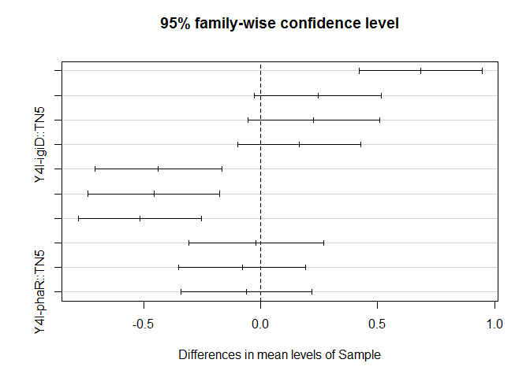
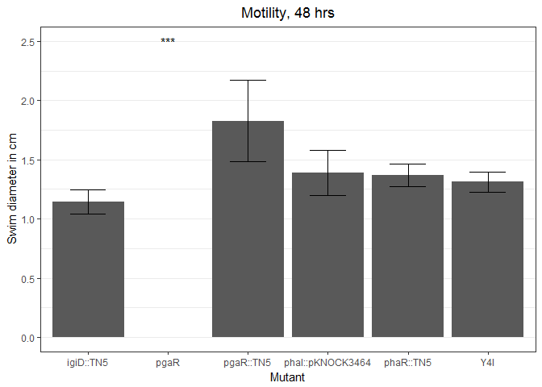

# Task 6
## Introduction
Quorum sensing (QS) allows bacterial populations to coordinate gene expression in a cell density dependent manner through the production and regulation of small diffusible signaling molecules. A prevalent class of signaling molecules in proteobacteria are N-acylhomoserine lactones (AHLs). AHL-based QS typically involves a two-component system consisting of a transcriptional regulator (denoted by -R) and an AHL synthase (designated as -I). In members of the roseobacter clade, AHL-based QS systems are hypothesized to facilitate surface colonization and gain a competitive advantage against other organisms through the production of secondary metabolites. 
The roseobacter clade is an extremely abundant, diverse, and metabolically active lineage of marine alphaproteobacteria. Members of the roseobacter clade make up a large portion of coastal marine bacteria and readily out-compete other marine bacteria for surface niches. One member of the roseobacter clade, *Phaeobacter* spp. Y4I, produces a dark blue, antimicrobial secondary metabolite called indigoidine. Indigoidine production is both surface attachment and QS dependent. Y4I possesses two QS systems, *pgaRI* and *phaRI*, that are involved in regulating the production of indigoidine. As surface colonization is a prerequisite to antimicrobial biosynthesis in this strain, Y4I serves as an excellent model organism to study the underlying regulatory mechanisms that allow a competitive advantage against other organisms. 
Previous studies in our lab have shown that a disruption via a Tn5-KmR insertion in either of the AHL-based QS transcriptional regulators in Y4I, *phaR* and *pgaR*, influence indigoidine production. The *phaR* mutant results in a delayed pigmentation, whereas, disruption in *pgaR* results in the abolishment of pigment production. While both QS systems are necessary for wildtype (WT) levels of indigoidine expression, a disruption in *pgaR* suggests this pathway is more directly involved in indigoidine production. However, recent genomic analysis of Y4I suggests that the regulatory mechanisms involved in indigoidine production may act in a hierarchal manner as is the case with *Dinoroseobacter shibae*. In order to elucidate the regulatory networks responsible for the competitive advantage provided by indigoidine in Y4I, I have focused on obtaining AHL synthase (i.e., *phaI* and *pgaI*) mutants and characterizing their phenotype in terms of motility.

##Methods
###AHL Synthase Mutants
Mutants were generated using the pKNOCK suicide vector system. Using pKNOCK-KmR, we cloned a ~300 bp fragment of our target gene into the vector creating pKNOCK3464. This vector was then transformed into a compepent donor cell, BW20767. The contruct was incorporated into Y4I Through conjugation with the donor strain. Because Y4I does not contain the *pir* gene, an essential gene for pKNOCK replication, the construct will insert into the genome using site specific homologous recombination.   

###Characterization of AHL Synthase Mutants

####Motility Assays
Swimming motility was assessed as previously reported (Cude 2015). Twenty microliters of stationary phase cultures (OD 540 of ~1.5) was spotted onto the motility plates and incubated at 30C in a humidity chamber and scored after 48 h by measuring the diameter of the swim circle. 


##Results and Discussion 
Given that quorum sensing has been shown to affect motility in members of the Roseobacter clade, the *phaI*::pKNOCK3464 mutant was assayed for differences in motiltiy and compared to the motility of previously established Y4I mutants. Motility of *phaI*::pKNOCK3464 mutant showed no significant difference when compared to wildtype (p < 0.05). Contrary to previous results, motility of *pgaR*::TN5 was enhanced in soft-agar assays relative to that of the wildtype (p < 0.00001). All mutants showed signs of swimming when viewed microscopically. 


```r
#################
# Accomplishes task 6
#################

## Packages needed for this script

library(dplyr) # package that manipulates dataframes
```

```
## 
## Attaching package: 'dplyr'
```

```
## The following objects are masked from 'package:stats':
## 
##     filter, lag
```

```
## The following objects are masked from 'package:base':
## 
##     intersect, setdiff, setequal, union
```

```r
library(ggplot2)

## read data in relative path

motility <- read.csv("../data/motility4.csv") # reads motility data into a vector called motility


motility_summ <- group_by(motility, Sample) %>% #takes exisiting table (motility in this case) and converts it into a grouped table where operations are performed by "group" (Sample)
  ## %>% denontes that Sample will be on the left 
  summarise(mean.d = mean(cm, na.rm=TRUE), sd.d=sd(cm, na.rm=TRUE)) # the data that is summarised. Put the mean of the diameter (cm) in a vector called mean.d and the standard deviation into a vector called sd.d
## na.rm = TRUE meands not to calculate NAs 


## Now we want to know if there's a significant difference in the mean diameter amongst our samples so run one way anova

fit <- aov(cm~Sample, data = motility)
summary(fit) # prints anova table
```

```
##             Df Sum Sq Mean Sq F value  Pr(>F)    
## Sample       4  2.307  0.5768   15.23 1.9e-07 ***
## Residuals   37  1.402  0.0379                    
## ---
## Signif. codes:  0 '***' 0.001 '**' 0.01 '*' 0.05 '.' 0.1 ' ' 1
```

```r
print(model.tables(fit, "means"), digits = 3) # prints table of sample means
```

```
## Tables of means
## Grand mean
##         
## 1.41119 
## 
##  Sample 
##     igiD::TN5 pgaR::TN5 phaI::pKNOCK3464 phaR::TN5  Y4I
##          1.14      1.83             1.39      1.37 1.31
## rep      9.00      9.00             8.00      7.00 9.00
```

```r
## There's a signicant difference, now to find out between which samples

sig<- TukeyHSD( x = fit, conf.level = 0.95) # Tukey HSD with a 95% confidence level. 
plot(sig)
```

<!-- -->

```r
print(sig)
```

```
##   Tukey multiple comparisons of means
##     95% family-wise confidence level
## 
## Fit: aov(formula = cm ~ Sample, data = motility)
## 
## $Sample
##                                   diff         lwr        upr     p adj
## pgaR::TN5-igiD::TN5         0.68333333  0.42030616  0.9463605 0.0000001
## phaI::pKNOCK3464-igiD::TN5  0.24555556 -0.02556665  0.5166778 0.0917604
## phaR::TN5-igiD::TN5         0.22698413 -0.05420375  0.5081720 0.1632549
## Y4I-igiD::TN5               0.16666667 -0.09636051  0.4296938 0.3797088
## phaI::pKNOCK3464-pgaR::TN5 -0.43777778 -0.70889998 -0.1666556 0.0004036
## phaR::TN5-pgaR::TN5        -0.45634921 -0.73753708 -0.1751613 0.0003759
## Y4I-pgaR::TN5              -0.51666667 -0.77969384 -0.2536395 0.0000189
## phaR::TN5-phaI::pKNOCK3464 -0.01857143 -0.30734570  0.2702028 0.9997289
## Y4I-phaI::pKNOCK3464       -0.07888889 -0.35001110  0.1922333 0.9182238
## Y4I-phaR::TN5              -0.06031746 -0.34150534  0.2208704 0.9717993
```

```r
## plot means of samples with error bars representing standard deviation
label.df <-data.frame (Sample = c( "pgaR"), mean.d = c(2.5))

p<-ggplot(data=motility_summ, aes (x = Sample, y = mean.d))+ geom_bar(stat="identity", position = "dodge")+ geom_errorbar(aes(ymax = mean.d+sd.d, ymin = mean.d-sd.d), width = 0.45)  #bar plot with error bars using data summary with sample averages and standard devations. 


## add lines and * to indicate significant differences between samples ##

p2<-p + geom_text(data = label.df, label = "***") #adds astricks above pgaR from label.df

p3<-p2


## adjust gridlines 
p4<-p3+ theme_bw()+ theme(plot.background = element_blank(), panel.grid.major.x = element_blank(), panel.grid.minor.x= element_blank()) 

## rename x and y axis and add chart title 
p4 + ggtitle("Motility, 48 hrs") + theme(plot.title = element_text(hjust = 0.5)) + ylab("Swim diameter in cm") + xlab("Mutant")
```

<!-- -->


